<p align="center">
  
</p>

<h1 align="center">Church Helper Desktop</h1>

<p align="center">
  <strong>Un aiuto per chi, ogni settimana, prepara i materiali della chiesa.</strong>
</p>

<p align="center">
  
  
  
  
  
</p>

---

## Cos'è

Church Helper è una piccola app desktop, **gratuita e open-source**, pensata per i **volontari
dei team comunicazione e delle regie** delle chiese locali. Ogni settimana arrivano nuovi
materiali — video, immagini, documenti — da preparare per il culto e le attività. Church Helper
li **controlla, scarica e organizza da solo** sul tuo computer, così non devi più andarli a
cercare a mano in una casella email o su un sito.

L'idea è semplice: **meno tempo a scaricare file, più tempo per le persone.**

## A chi serve

- A chi in chiesa si occupa di **comunicazione** (social, video, annunci).
- Alla **regia** audio/video che manda in onda il culto e ha bisogno dei materiali pronti in tempo.
- A chiunque, **anche senza competenze tecniche**, debba avere ogni settimana i file giusti nella
  cartella giusta.

## Nota di indipendenza

> **Church Helper è un progetto indipendente e volontario.** Non è affiliato, sponsorizzato,
> approvato né gestito dall'Unione Italiana delle Chiese Cristiane Avventiste del Settimo Giorno
> (UICCA) o da alcuna sua articolazione, dipartimento o ente collegato. Nasce per alleggerire il
> lavoro pratico dei volontari, ma **non parla a nome della Chiesa** e non ne rappresenta le
> posizioni ufficiali. Per informazioni istituzionali fai riferimento ai canali ufficiali, tra cui
> [chiesaavventista.it](https://chiesaavventista.it/) e [HopeMedia Italia](https://hopemedia.it/).

## Funzionalità

- 🔄 **Controllo automatico** — ogni tot minuti verifica se ci sono materiali nuovi (oppure lo
  fai a mano quando vuoi).
- ⬇️ **Download automatico** delle categorie che scegli tu; gli altri li scarichi con un clic.
- 📁 **Organizzazione per settimana** — ogni materiale finisce in una sottocartella ordinata
  (es. `W19-2026-05-09`).
- ▶️ **Riprende i download interrotti** e verifica l'integrità di ogni file scaricato.
- 🎞️ **Risparmio di spazio e banda** — quando è disponibile una versione video già ottimizzata la
  preferisce, e ti mostra quanto hai risparmiato.
- ♻️ **Materiali ripubblicati ("errata corrige")** — se un file viene ripubblicato se ne accorge,
  archivia la versione vecchia e scarica quella nuova.
- 🧹 **Pulizia automatica** dei materiali delle settimane passate, con una politica di
  conservazione configurabile.
- 🔔 **Notifiche** quando arriva qualcosa di nuovo, e icona nella barra di sistema per restare in
  background.
- 🌗 **Interfaccia in italiano e inglese**, con tema chiaro, scuro o automatico.
- ⬆️ **Si aggiorna da solo**, chiedendoti sempre conferma prima di installare.

## Come funziona

I materiali partono da una **newsletter settimanale** e vengono resi disponibili da alcuni piccoli
servizi che lavorano dietro le quinte. Church Helper è il **client**: interroga quei servizi,
scarica i file e li mette in ordine sul tuo computer. Serve quindi una connessione a internet.

Ecco come i pezzi si parlano tra loro:

```mermaid
flowchart LR
    Newsletter["📧 Newsletter settimanale<br/>(email coi materiali)"]
    Operatore["🙋 Volontario di comunicazione / regia"]

    subgraph MPS["🐍 mail-parser-service · FastAPI — un servizio, due ruoli"]
        direction TB
        Scraper["Lettore newsletter<br/>polling IMAP + parsing"]
        DB[("SQLite · elenco e versioni")]
        API["Backend / API REST<br/>/api/resources/…"]
        Scraper --> DB --> API
    end

    ReEncoder["🎬 re-encoder · Go + FFmpeg<br/>ottimizza i video (HEVC)"]
    Volume[("📁 Volume video condiviso<br/>servito da nginx")]
    Desktop["🖥️ Church Helper Desktop<br/>Tauri 2 · l'app degli operatori"]

    Newsletter -->|"① IMAP"| Scraper
    API -->|"② elenco materiali (polling)"| ReEncoder
    ReEncoder -->|"③ scarica gli originali · scrive gli ottimizzati"| Volume
    Volume -.->|"④ scansione in sola lettura: abbina file → materiale"| API
    API -->|"⑤ elenco JSON: link originale + ottimizzato"| Desktop
    Volume -->|"⑥ download dei byte (via nginx)"| Desktop
    Desktop -->|"⑦ materiali pronti, ordinati per settimana"| Operatore
```



> In breve: la newsletter viene letta e trasformata in un elenco di materiali; un servizio
> ottimizza i video più pesanti; l'app scarica ciò che serve, preferendo le versioni ottimizzate.
> I byte dei video sono serviti da nginx, mentre i video originali restano ai link della newsletter.

## Screenshot

_In arrivo._ Se vuoi contribuire con degli screenshot dell'app in uso, sei il benvenuto — vedi
[Come contribuire](#come-contribuire). Le immagini vanno in `docs/assets/`.

## Installazione (per chi non è sviluppatore)

1. Apri la pagina **[Releases](https://github.com/smoxy/church-helper-desktop/releases)** del progetto.
2. Scarica il file adatto al tuo sistema:
   - **Windows** — l'installer `.msi` oppure `.exe`
   - **Linux** — il pacchetto `.deb`
3. Aprilo e segui l'installazione. Al primo avvio scegli la **cartella** dove vuoi i materiali e le
   **categorie** da scaricare in automatico.

> **macOS** non è ancora supportato: è un obiettivo futuro.

**Disinstallazione:** usa gli strumenti standard del sistema (Impostazioni → App su Windows;
rimozione del pacchetto su Linux).

## Come contribuire

Questo è un progetto fatto **nel tempo libero, da volontari**. Ogni contributo conta — e
**non serve saper programmare**:

- 🧪 **Prova l'app** (beta testing) nel tuo uso reale e raccontaci cosa non va.
- 💬 **Feedback e segnalazioni** — cosa funziona, cosa manca, cosa ti farebbe risparmiare tempo.
- 🌍 **Traduzioni** — l'app è già in italiano e inglese: puoi migliorare i testi o aggiungere una lingua.
- 🎨 **Grafica** — cerchiamo un logo vero (per ora c'è un segnaposto) e delle icone.
- 📖 **Documentazione** — guide passo-passo e tutorial per chi non è tecnico.
- 📣 **Passaparola** — falla conoscere ad altre regie e team comunicazione.
- 🤝 **Metti in contatto** persone con competenze utili (video, scrittura, sviluppo, grafica).
- 💻 **Codice** — se programmi, le Pull Request su Rust / TypeScript / Tauri sono benvenute
  (vedi [Per sviluppatori](#per-sviluppatori)).

Non sai da dove partire? **[Scrivici](#contatti)**: troviamo insieme il modo in cui puoi dare una mano.

## La visione: una rete di valore e di valori

Church Helper è solo un primo strumento. L'obiettivo più grande è costruire una **rete di persone**
che mettono gratuitamente, e in modo indipendente, le proprie competenze al servizio della
comunità — una **rete di valore e di valori**. Se questa idea ti parla, c'è posto anche per te.

## Contatti

Hai un dubbio, un'idea, un problema con l'app, o vuoi solo dire ciao? **Non serve essere
sviluppatori per scriverci** — ogni messaggio è benvenuto.

- ✉️ **Contributi e progetto** — [coding@rinoova.com](mailto:coding@rinoova.com)
- 🛠️ **Supporto sull'app** — [dev@adventistyouth.it](mailto:dev@adventistyouth.it)
- 🐙 **GitHub** — [@smoxy](https://github.com/smoxy): apri una
  *[Issue](https://github.com/smoxy/church-helper-desktop/issues)* per segnalazioni o proposte.

## Licenza e Privacy

- **Licenza:** [MIT](LICENSE) — software libero, fornito "così com'è", senza garanzie.
- **Privacy:** vedi [PRIVACY.md](PRIVACY.md). In breve, l'app **non raccoglie né invia dati
  personali**: contatta solo il servizio che elenca i materiali della settimana e i link (S3 /
  YouTube) da cui scaricarli.

---

## Per sviluppatori

<details>
<summary><strong>Stack, architettura, build da sorgente e troubleshooting</strong></summary>

### Stack

**Frontend** — React 19 + TypeScript, [Vite](https://vitejs.dev), Tailwind CSS 4,
[Zustand](https://github.com/pmndrs/zustand), React Router, `@tauri-apps/api`.

**Backend (Rust)** — [Tauri 2](https://tauri.app) (tokio, reqwest, serde), plugin Tauri
(`store`, `notification`, `dialog`, `autostart`, `updater`, `opener`, `process`), `tracing` per i
log, `sha2` per l'integrità dei file, `trash` per la retention.

L'app segue una separazione netta: **tutta la logica sta nel backend Rust**, il frontend React è
una UI "dumb" che invoca i comandi via IPC.

### Prerequisiti

- **Node.js** 20+
- **Rust** ([installa qui](https://www.rust-lang.org/learn/get-started))
- **Prerequisiti Tauri** ([guida](https://tauri.app/start/prerequisites/))

### Development

```bash
npm install
npm run tauri dev
```

### Build

```bash
npm run tauri build
# Output in: src-tauri/target/release/bundle/
```

### Puntare l'app a uno stub API locale (solo dev)

Solo nelle build di debug (`tauri dev` / `build` / `test`, **mai** in release) il backend legge la
variabile d'ambiente `CHURCH_HELPER_API_BASE`: se impostata, sostituisce la costante `API_BASE_URL`
(`src-tauri/src/constants.rs`) per ogni chiamata all'API risorse.

```bash
# 1. Avvia lo stub (repo sorella api-stub/, porta di default 8787)
cd ../api-stub && node server.mjs

# 2. In un altro terminale, punta il desktop allo stub
cd ../church-helper-desktop
CHURCH_HELPER_API_BASE=http://localhost:8787 npm run tauri dev
```

Senza questa variabile non cambia nulla: il desktop usa `API_BASE_URL` (produzione) come sempre.

### Log e troubleshooting

L'app usa `tracing`; il livello si controlla con `RUST_LOG` (default `info`).

```bash
# Debug di polling e download (utile per capire perché un download non parte)
RUST_LOG=church_helper_desktop_lib=debug ./church-helper-desktop

# Massimo dettaglio (molto verboso)
RUST_LOG=church_helper_desktop_lib=trace ./church-helper-desktop
```

### Struttura del progetto

```
church-helper-desktop/
├── src/                        # Frontend React + TypeScript (UI "dumb")
│   ├── components/features/     # Componenti per dominio (risorse, download, ...)
│   ├── stores/                  # Stato client (Zustand)
│   ├── pages/  layouts/         # Pagine e layout
│   ├── lib/i18n/                # Dizionari it/en
│   └── hooks/
└── src-tauri/                  # Backend Rust (tutta la logica)
    └── src/
        ├── commands.rs          # Comandi esposti al frontend (IPC)
        ├── models.rs            # Modelli dati (Resource, config, ...)
        ├── services/            # download, queue, polling, errata, retention
        └── lib.rs               # Setup app, tray, updater
```

Altri documenti utili nel repo: [`AGENTS.md`](AGENTS.md),
[`DOWNLOAD_ARCHITECTURE.md`](DOWNLOAD_ARCHITECTURE.md), [`UPDATER_SETUP.md`](UPDATER_SETUP.md).

</details>
